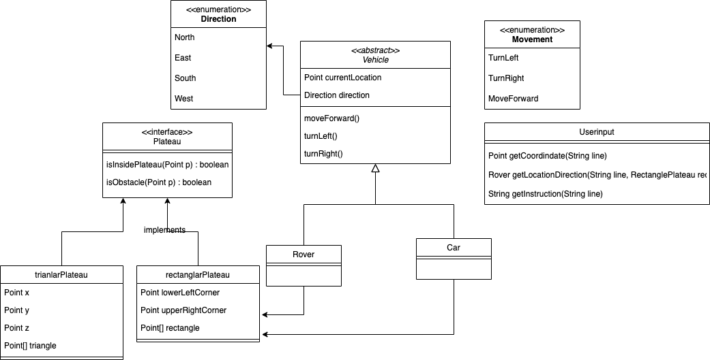

# Mars Rover Challenge

## Project Overview

The Mars Rover Challenge is an exciting project that involves the exploration
of the red planet. Our main goal is to develop a robust 
software solution that can handle the complex challenges
of navigating and exploring the Martian landscape.

## Key Features

1. To create a rectangle plateau using the coordinates of the left (0,0) and right(x,y) corner points.
2. To place the Rover inside a plateau at a specific point(x,y)
and facing a certain direction eg. North
3. To instruct the Rover to move in a specific direction using actions such as turning left,
turning right, moving forward.
4. Boundary checking

## Assumptions

1. The plateau is a square/rectanglar grid
2. Movement Rules : Rovers move sequentially, this means that the first Rover needs
to finish moving first before the next one can move

## UML Diagram

## Approaches

1. Create a UML diagram that outlines the basic structure and behavior of the rover, including its classes, methods and attributes.
2. Use this UML diagram as a guide for writing tests and implementing code, following a TDD approach. 
3. Write a set of test cases that cover the basic functionality of the rover (e.g. move forward, turning)
4. Create a straightforward commmand-line interface that allows users to input commands for the rover system.

## Future Thoughts

- Improved visual interface to provide a clearer depiction of the Plateau.
- Increased autonomy, allowing the rover to make more complex decisions on its own without human intervention.
- Development of a more durable and robust rover design to extend the duration of the mission and withstand harsh Martian conditions.
- Integration with aerial drones or other supplementary exploration vehicles to expand the range and scope of exploration.